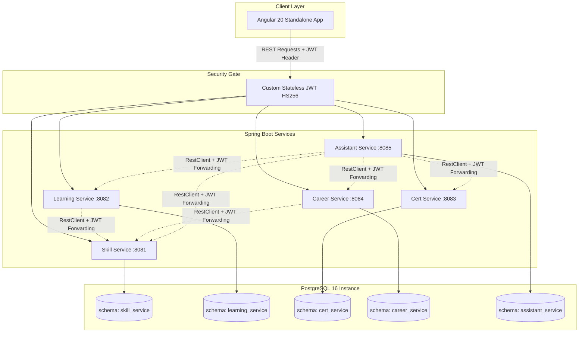

# ◈ SkillSphere Nexus — Enterprise Learning, Certification & Career Guidance Platform

**SkillSphere Nexus** is a unified, high-performance corporate growth network designed to align individual career development with organizational needs. Instead of disjointed tools for tracking training, external credentials, and promotions, it unifies them into a robust microservice architecture. 

A central highlight is **Levi**, an agentic, secure **Conversational AI Assistant** powered by the **Groq LLM** that acts as an intelligent career guide by analyzing skill gaps, pointing out relevant training courses, and matching employees to internal job listings.

---

## 📖 Table of Contents
* [1. The Solution & Business Case](#1-the-solution--business-case)
* [2. System Architecture](#2-system-architecture)
* [3. Technology Stack](#3-technology-stack)
* [4. Microservices Design & Decoupled Schema Model](#4-microservices-design--decoupled-schema-model)
* [5. Stateless Custom Authentication (JWT)](#5-stateless-custom-authentication-jwt)
* [6. Agentic AI Career Assistant (Levi)](#6-agentic-ai-career-assistant-levi)
* [7. Repository Structure](#7-repository-structure)
* [8. Development Setup & Launch Instructions](#8-development-setup--launch-instructions)

---

## 1. The Solution & Business Case

In modern enterprise environments, talent retention suffers due to a lack of clear career visibility:
1. Employees don't know what skills they lack to earn a promotion.
2. Certifications expire without warning, leaving teams non-compliant.
3. Internal job postings are invisible or disconnected from training resources.

**SkillSphere Nexus** bridges this gap. It catalogs talent, drives upskilling through sequential learning paths, tracks certification compliance, exposes a transparent internal job marketplace, and overlays an AI assistant to guide employees at every step.

---

## 2. System Architecture

The ecosystem consists of an Angular standalone frontend communicating with five autonomous Spring Boot microservices. Each service owns its database schema under a single PostgreSQL instance:



---

## 3. Technology Stack

* **Frontend**: **Angular 20** (Standalone Components, Signals state management, Router, SCSS, Material Design, Dark UI dashboard).
* **Backend**: **Java 21 (LTS)** and **Spring Boot 3.x** (MVC, Security, RestClient).
* **Database**: **PostgreSQL 16** (Schema-per-service database model).
* **Database Migrations**: **Flyway** (Each service hosts its separate migration folders under `src/main/resources/db/migration`).
* **AI Engine**: **Groq API** (Llama3 model) with OpenAI-compatible tool/function call definitions.

---

## 4. Microservices Design & Decoupled Schema Model

To guarantee service autonomy, **zero cross-schema foreign keys** are allowed at the database level. Services refer to entities across boundaries purely through logical UUID columns (e.g., `employee_id`).

### 1. Skill Service (Port `8081` | Schema `skill_service`)
* **Role**: Inventory of Talent.
* **Core Responsibilities**: User registrations, BCrypt hashing, JWT generation, employee profile registry, skill self-assessments, and competency framework metrics.

### 2. Learning Service (Port `8082` | Schema `learning_service`)
* **Role**: Upskilling Engine.
* **Core Responsibilities**: Course catalogs, modular syllabus management, sequential learning paths (e.g. "Full Stack Developer Path"), and course enrollment/completion logs.

### 3. Certification Service (Port `8083` | Schema `cert_service`)
* **Role**: Compliance & Audit.
* **Core Responsibilities**: External credentials catalog (AWS, Scrum, etc.), expiry alerts, corporate compliance calculation, and course certificate request approvals.

### 4. Career Service (Port `8084` | Schema `career_service`)
* **Role**: Growth Navigator.
* **Core Responsibilities**: Professional mentorship assignments, timeline goals, standard organizational roadmaps, and an internal job posting board featuring real-time **Skill-Match Percentage calculations**.

### 5. Assistant Service (Port `8085` | Schema `assistant_service`)
* **Role**: Agentic LLM Orchestrator.
* **Core Responsibilities**: Managing LLM conversation histories, system prompts, tool executions, and audit logging.

---

## 5. Stateless Custom Authentication (JWT)

We avoid complex Keycloak overhead in favor of a clean, decentralized stateless JWT mechanism:
1. On login, the **Skill Service** verifies credentials and signs a JWT containing `sub` (user ID), `email`, `role`, and `exp`.
2. The signature is encrypted using an HS256 shared secret (`JWT_SECRET`).
3. Every other microservice runs the identical `JwtAuthFilter` inside its Spring Security chain, verifying incoming `Authorization: Bearer <token>` headers locally using the same secret.

---

## 6. Agentic AI Career Assistant (Levi)

**Levi** is a conversational AI companion designed to act as an assistant career planner:

1. **Groq Function Calling Loop**: When a user queries Levi, the LLM determines whether it needs database information and requests tool executions (e.g. `get_employee_skills`).
2. **16 Functional Tools**: Exposes endpoints from all four core microservices covering profiles, enrollments, credentials, career plans, and compliance data.
3. **JWT Identity Propagation**: Levi forwards the active caller's JWT token to downstream APIs, automatically enforcing API level role-based access.
4. **Prompt Injection & Parameter Hijack Protection**: In `AssistantService.java`, if the LLM requests data with an explicit `employeeId`, the Java code overrides it with the caller's actual UUID extracted from the JWT unless the user is an `ADMIN` or `HR_MANAGER`.
5. **Auditing**: Every tool call is logged in the `tool_audit_logs` table for compliance and model evaluation.

---

## 7. Repository Structure

```
skillsphere-nexus/
├── README.md
├── run.bat                     (Dev environment runner launcher script)
├── run.ps1                     (PowerShell execution engine script)
├── services/
│   ├── skill-service/          (Port 8081)
│   ├── learning-service/       (Port 8082)
│   ├── certification-service/  (Port 8083)
│   ├── career-service/         (Port 8084)
│   └── assistant-service/      (Port 8085)
└── frontend/
    └── skillsphere-app/        (Angular 20 app, Port 4200)
```

---

## 8. Development Setup & Launch Instructions

### Prerequisites
* Java Development Kit (JDK 17 or 21)
* Node.js (v18 or v20)
* PostgreSQL 16 (running on Port 5432)

### 1. Database Setup
Create the root database in your PostgreSQL instance:
```sql
CREATE DATABASE skillsphere_nexus;
```
*(The Flyway migration script in each microservice will automatically initialize schemas, tables, and seed mock data on first startup).*

### 2. Environment Variables Configuration
Create a `.env` file in the root directory:
```properties
JWT_SECRET=your_32_character_super_secure_jwt_shared_secret
GROQ_API_KEY=your_groq_api_llm_key
```

### 3. Launching the Services
We provide a simple, unified Windows script to run your complete developer workspace:
```cmd
.\run.bat
```
This opens options to spin up individual services or choose `[0] Run All Services + Frontend` to automatically boot the entire ecosystem in separate PowerShell windows.
